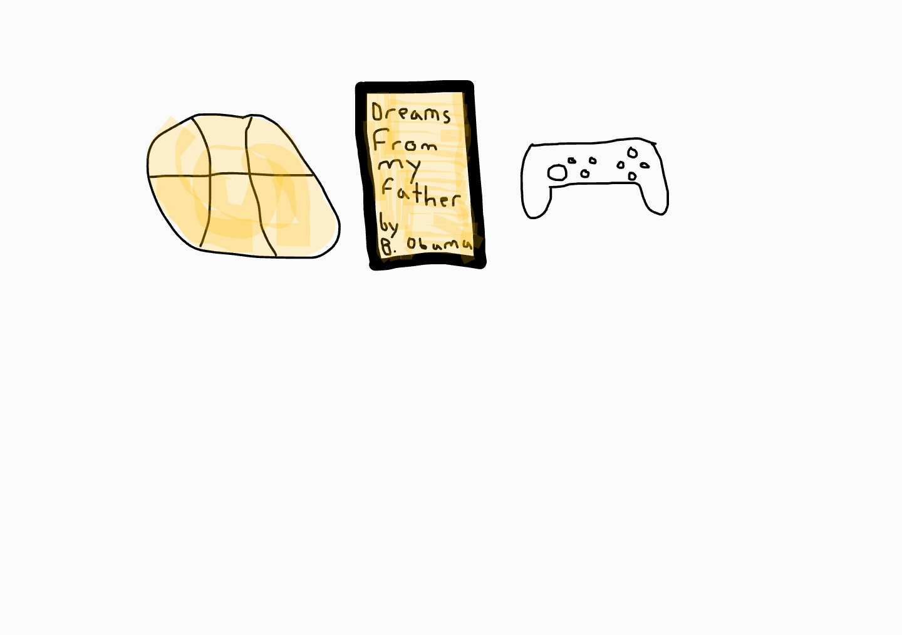

# **<u>Ishraq's Page</u>**

Got to my [Github Account](https://github.com/Ishraqh1)

---

## <strong style="color:green">Here is my freeform image!</strong>

Here are some interesting things about me

| I love the members of my CSP Group      | I enjoy playing basketball with friends |
| ----------- | ----------- |
| I like reading books in my free time      | I like to listen to music when I get the chance       |
| Lebron James is my favorite player   | I'm a proud member of Del Norte        |

## Overview of Hacks, Study and Tangibles
Blogging in GitHub pages is a way to learn and code at the same time. 

- Plans, Lists, [Scrum Boards](https://clickup.com/blog/scrum-board/) help you to track key events, show progress and record time.  Effort is a big part of your class grade.  Show plans and time spent!
- [Hacks(Todo)](https://levelup.gitconnected.com/six-ultimate-daily-hacks-for-every-programmer-60f5f10feae) enable you to stay in focus with key requirements of the class.  Each Hack will produce Tangibles.
- Tangibles or [Tangible Artifacts](https://en.wikipedia.org/wiki/Artifact_(software_development)) are things you accumulate as a learner and coder. 
